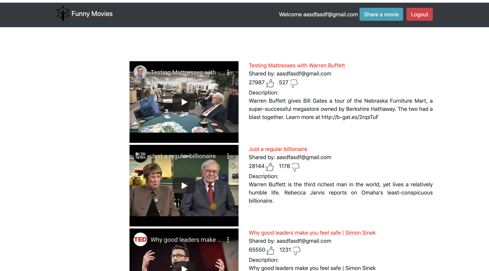
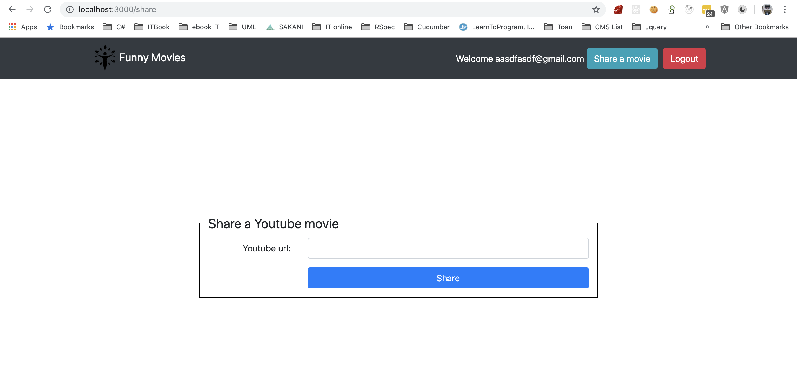

# Sharing Youtube Video
> Remitano Test Assignment

## Table of contents
* [Screenshots](#screenshots)
* [Technologies](#technologies)
* [Setup](#setup)
* [Features](#features)
* [Run Test](#test)
* [Start App](#start)
* [Status](#test)
* [Contact](#contact)

## Screenshots

## Technologies
* Ruby - version 2.4.9
* Rails - version 5.2.0
* Database - PostgreSQL

## Setup
Describe how to install / setup your local environement / add link to demo version.

## Features
List of features

* Register: As a new user, I want to create an account and sign in by entering the username and password for the first time.

* Register: As a new user, I want to create an account and sign in by entering the username and password for the first time. (Picture 1)

* Share movie: As a signed in user, I want to share a youtube movie by clicking “Share a movie” button (Picture 2) and filling the share form

* See movie list: As a visitor, I want to see a list of all shared movies. (no need to display the number of up/down votes)

## Run Test
Run a test: `bundle exec rails test`

## Start App
Start application: `bundle exec rails s`

## Status
Project is: _finished_

## Contact
Created by [@Nguyen Ngoc Hai](https://github.com/hoasung01/SharingKnowledge/blob/master/Interview/CV/Assets/NguyenNgocHai_CV.pdf) - feel free to contact me!